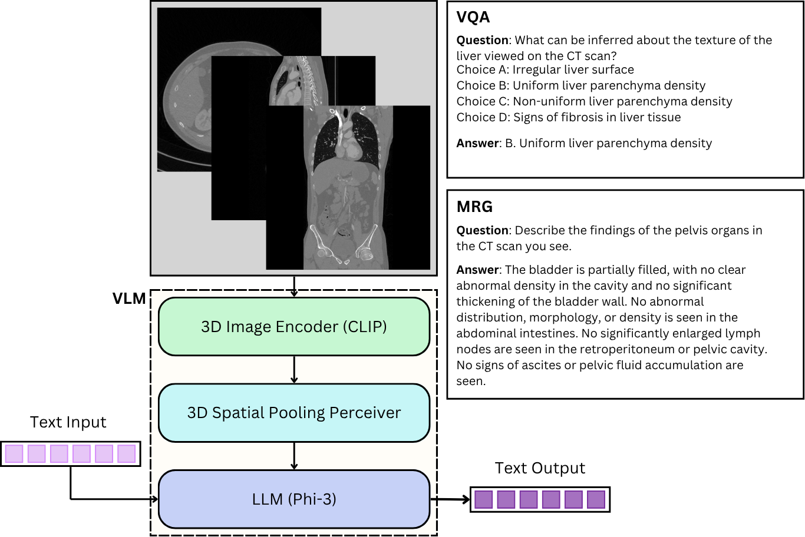

# M3: Multimodal AI for Medical Report Generation and Visual Question Answering from 3D Abdominal CT Scans
<p align="center">
  
</p>

Medical imaging is indispensable for diagnosis, with abdominal imaging playing a pivotal role in generating medical reports and informing clinical decision-making. Recent works in artificial intelligence (AI), particularly in multimodal approaches such as vision-language models, have demonstrated significant potential to enhance medical image analysis by seamlessly integrating visual and textual data. While 2D imaging has been the main focus of many studies, the enhanced spatial detail and volumetric consistency offered by 3D images, such as CT scans, remain relatively underexplored. This gap underscores the need for innovative approaches to unlock the potential of 3D imaging in clinical workflows. In this study, we utilized a multimodal AI pipeline, Phi3-V, to address 2 key challenges in abdominal imaging: generating clinically coherent medical reports from 3D CT images and performing visual question answering based on these images.

## Finetuning

To fine-tune the model, follow these steps:

1. **Run Initialization Script**:
   ```sh
   sh modify_m3d.sh
   ```

2. **Navigate to M3D Directory**:
   ```sh
   cd M3D
   ```

3. **Run Fine-Tuning Script** :
   ```sh
   sh LaMed/script/finetune_lora.sh
   ```

### Important Notes 
- Make sure to **update the paths** for:
  - Datasets 
  - Pretrained weights for the Image encoder and projector 
  - Output directory 


## Merge 

After finetuning, you need to merge LoRA weights with the original weights. Follow :

1. **Run the Merge Script** :
   ```sh
   python3 -u merge_lora_weights_and_save_hf_model.py \
   --model_type phi3 \
   --model_with_lora PATH_TO_FINETUNED_MODEL \
   --pretrain_mm_mlp_adapter PATH_TO_PRETRAINED_PROJECTOR \
   --pretrain_vision_model PATH_TO_PRETRAINED_VISION_ENCODER
   ```

### Important Notes 
- Make sure to **replace placeholders** with the correct paths for:
  - Finetuned model 
  - Pretrained projector 
  - Pretrained vision encoder 

## Demo 

To run the demo, follow these steps:

1. **Run Initialization Script** :
   ```sh
   sh modify_m3d.sh
   ```

2. **Generate Report** :
   ```python3 -u demo_csv.py \
   --model_name_or_path PATH_TO_MERGED_WEIGHTS \
   --data_root PATH_TO_IMAGES \
   --amos_validation_cap_data_path PATH_TO_CSV_FILE \
   --output_dir PATH_TO_OUTPUT_DIR
   ```

## Dataset Format 

For this work, we have converted the data into CSV files. The format for training captions should be as follows:

| **image**   | **caption** | **label** |
|-------------|-------------|-----------|
| image_path  | text        | organ     |

### Columns Description
- **image**: Path to the image file 
- **caption**: Text description of the image 
- **label**: organ of the entry

## Acknowledgement
We appreciate open source projects including: 
[LLaVA](https://github.com/haotian-liu/LLaVA) and 
[M3d](https://github.com/BAAI-DCAI/M3D), 